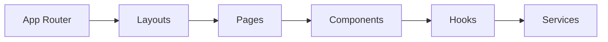

# ✨ Poll Studio - Frontend

A high-fidelity, real-time polling interface built with **Next.js 14**, **Tailwind CSS**, and **TypeScript**.

[](https://render.com)
[](https://nextjs.org)

## 🎨 Premium UI & Design

The frontend follows a "Glassmorphism" aesthetic:
- **Radial Gradients**: Dynamic background colors using `radial-gradient`.
- **Blur Effects**: `backdrop-blur` on headers and cards for a depth feel.
- **Micro-Animations**: Smooth hover transitions and loading states.
- **Typography**: Clean, sans-serif font system (Geist) with premium weights.

---

## ⚡ Key Features

- **Live Data Streaming**: Real-time poll progress with WebSockets.
- **Atomic Components**: Reusable, well-structured UI primitives.
- **Smart Routing**: Support for auth-protected routes (`/create`) and public voting (`/poll/:id`).
- **Responsive Layout**: Fluid design that handles everything from mobile to ultrawide.
- **Optimized Performance**: Next.js 14 App Router for fast initial loads.

---

## 🛠️ Getting Started

### 1. **Clone & Install**
```bash
git clone https://github.com/Nirbhay774/realtime-poll-system-frontend.git
cd realtime-poll-system-frontend
npm install
```

### 2. **Environment Setup**
Create `.env.local`:
```env
NEXT_PUBLIC_BACKEND_URL=https://your-backend.onrender.com
NEXT_PUBLIC_WS_URL=wss://your-backend.onrender.com
```

### 3. **Run Locally**
```bash
npm run dev
```

---

## 🚀 Deployment (Static & Web)

The application is optimized for modern hosting:
- **Web Service (Recommended)**: Use `npm run build` and `npm start`.
- **Static Hosting**: Includes `_redirects` and `vercel.json` for seamless SPA routing.

## 🧬 Frontend Architecture


## 📜 License
MIT License - Developed by [Nirbhay](https://github.com/Nirbhay774)